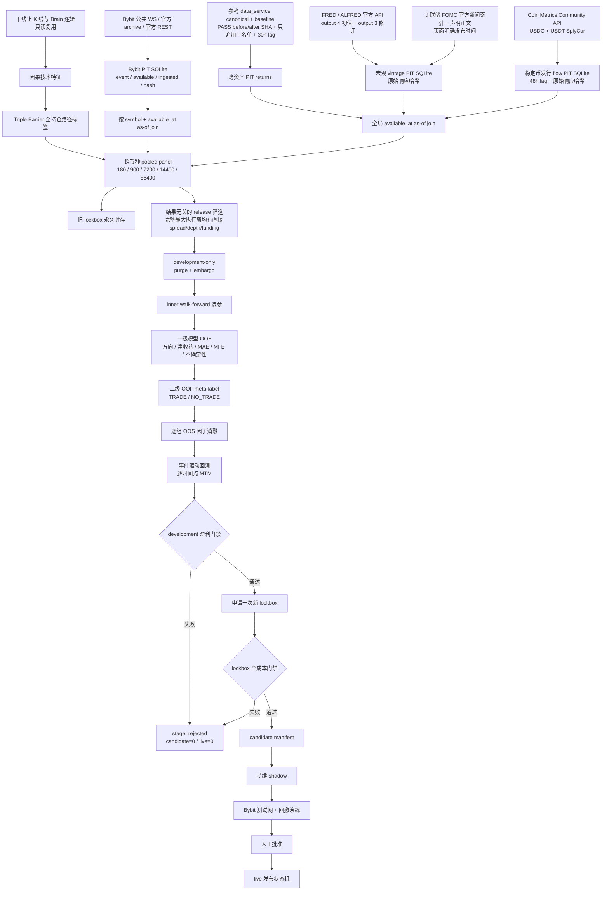
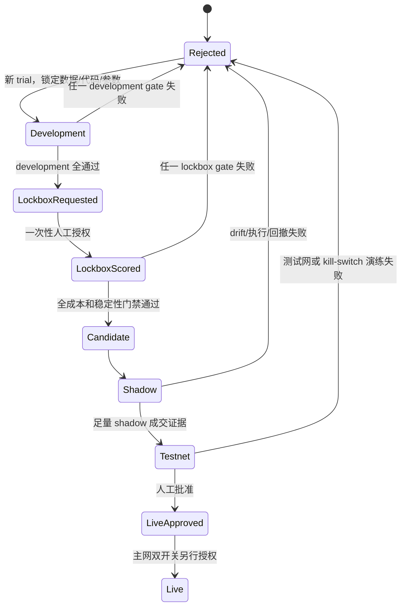

# Profitability-First Alpha v2：真实架构与边界

> 状态：shadow 工程候选，尚未达到 candidate/live 盈利门禁。当前 Brain 模型只保留为 baseline；Bybit 主网交易开关未启用。

## 1. 目标和成功定义

这套重构不以测试数量或分类准确率为成功标准。成功必须同时具备：

- 完全未参与调参的 lockbox 在手续费、点差、滑点、资金费后净收益为正；
- Profit Factor、bootstrap 收益下界、walk-forward 稳定性和真实盘中回撤全部过门禁；
- 收益不集中于单币种、单月份或单一行情；
- 通过持续 shadow、测试网、回撤演练和人工批准；
- 任一证据不足时失败关闭，不产生 `candidate_release_manifest.json` 或 OperationTicket。

任何历史结果都不能保证未来保本或必然盈利。

## 2. 总体架构图

## 3. 模块职责

| 层 | 主要模块 | 只负责什么 | 不允许做什么 |
|---|---|---|---|
| 原始数据 | `core/providers/*` | 抓取、解析、哈希、PIT 时间和 append-only 证据 | 训练、调参、生成交易信号 |
| PIT 接入 | `core/training/bybit_pit_panel.py`、`macro_pit_panel.py`、`flow_pit_panel.py`、`pit_factor_panel.py` | 冻结 sequence/SHA，按决策时间 as-of join，执行 staleness 和来源契约；Bybit 训练快照先按 development 决策窗裁剪 | 广播当前值到历史、整库载入无关未来观测、填造缺失因子 |
| 标签 | `core/labels/triple_barrier.py` | entry fill、TP/SL、max holding、费用、MAE/MFE、partial fill、exit reason | close-to-close 冒充成交结果 |
| 数据集 | `core/training/pooled_panel.py`、`core/evaluation/profitability_rebuild.py` | pooled panel、因果 regime、完整最大执行窗 direct-evidence release 子集、purge、embargo、sealed lockbox | 使用全样本定义 regime、按收益/退出原因选择 direct 样本、让 OHLCV 代理成本进入候选 folds、物化封存 lockbox 标签 |
| 选模 | `core/training/nested_walk_forward.py` | inner OOS 选参，outer OOS 只评分一次 | 用 outer OOS 调参 |
| 模型 | `core/models/two_stage.py` | 一级 OOF 预测、二级 meta-label、OOF conformal/分位数校准 | 用训练内残差训练二级或声称校准 |
| 回测 | `core/backtest/event_driven.py` | 手续费、点差、动态滑点、funding、partial fill、timeout、latency、路径、MTM | 省略成本、只算收盘收益 |
| 门禁 | `core/evaluation/profitability_gate.py` | development/lockbox 盈利、回撤、稳定性、集中度和压力测试 | 降低门槛迁就模型 |
| 发布 | `core/release/*` | 绑定模型、报告、commit、lockbox fingerprint | 未过门禁生成 candidate/live |
| 生产推理 | `core/models/profitability_runtime.py`、`core/result_manager.py` | 按签名 feature contract 读取 trad、Bybit、macro、flow 的最新严格 PIT 值，验证 release manifest 后产生并消费 `alpha_prediction` | 缺特征时降级填造、Brain baseline 独立出票 |
| 交易安全 | 原 hardening 交易模块 | cancel/REPLACE、hedge、kill switch、双开关 | 被研究代码绕过 |

## 4. 固定周期契约

周期定义只有以下一套：

| 名称 | 秒 | K 线 |
|---|---:|---|
| scalping | 180 | 3m |
| mid_short | 900 | 15m |
| trend | 7200 | 2h |
| trend_swing | 14400 | 4h |
| swing | 86400 | 1d |

标签、训练、模型 artifact、runtime 和 `ResultManager` 都必须使用同一秒数；不允许用旧名称偷偷映射到别的周期。

## 5. 当前真实因子来源

### 5.1 旧线上经验的复用

- 价格、成交量和 Brain 技术逻辑仍作为 `legacy_brain_technical` baseline。
- 旧模型、数据库和策略均保留，当前状态为 rejected/baseline，不独立出票。
- 因果技术特征只使用决策点之前的 K 线；regime 在每个训练窗口内因果计算。

### 5.2 Bybit 短周期

| 因子组 | 原始来源 | 证据语义 |
|---|---|---|
| orderbook | Bybit public orderbook WS、官方历史 archive | L5 delta、spread、depth、microprice；archive 是 exchange-event replay，不冒充 live capture |
| public trades | Bybit public trades WS、官方历史 archive | trade imbalance、OFI/CVD；保留 event/available/ingested 时间 |
| derivatives | Bybit 官方 funding、OI、mark/index kline REST | basis、settled funding、OI change；每个响应保留哈希和请求 manifest |
| liquidations | `allLiquidation` public WS | 按 Bybit 语义 `S=Buy => long position liquidated`；v1 永久失效，v2 生效 |
| execution quality | 真实盘口状态派生 | fill probability、expected slippage；没有盘口证据时不得用 OHLCV 猜测代替 |

### 5.3 中长周期跨资产

参考服务仅接纳 canonical panel 中显式白名单的基础价格。接入时同时核验最近一次 PASS 收据的 `canonical_sha_before`/`canonical_sha_after`、baseline/canonical 文件哈希，并逐行证明允许标的只追加新日期、没有改写或回填旧价格：

- SPY、QQQ；
- TLT、UUP；
- GLD、USO；
- XLV、IBB；
- FXI、KWEB；
- COIN、MSTR。

日频值使用 30 小时保守可用延迟。当前值、公式衍生列、无 PIT 的 MCP 列不得回填历史。SHA 绑定的全面板审计可以因为未使用的衍生列而失败，但 `symbol/ts/close` 范围内出现任何问题都会失败关闭；运行时还会重新读取该审计，不能靠进程缓存绕过后来新增的问题。价格水平不作为模型输入，只生成相邻市场收盘收益。

### 5.4 FRED / ALFRED vintage

| 因子 | 官方 series / output | 说明 |
|---|---|---|
| VIX | VIXCLS / output 4 | 初次发布值；节假日 carry 行使用更保守的 observation/vintage 最大日期 |
| 10Y 实际利率 | DFII10 / output 4 | 真实 TIPS real yield，不再用名义利率减 CPI 的代理冒充 |
| CPI 初值同比 | CPIAUCSL / output 4 | 只使用各月 first release |
| 非农初值变化 | PAYEMS / output 4 | 相邻月份 first-release level 差 |
| 失业率初值 | UNRATE / output 4 | first release |
| CPI/非农修订 | CPIAUCSL、PAYEMS / output 3 | 按 vintage 的实际修订 delta |
| Tier-A 状态 | CPI/非农 release vintage | 发布后 24 小时为 1，随后显式复位为 0 |
| FOMC 声明状态 | 美联储官方 FOMC 新闻索引和声明正文 | 只在页面明确标注的 release time 后变为 1，24 小时后复位；包含 2020 年紧急声明 |

FOMC 采集不能用会议日历日期猜测 14:00，也不能把 minutes、implementation note 或未来会议计划当成已发布声明。2018–2026-06-18 的实际研究仓证据为 70 份声明、79 份官方响应、140 个状态切换，时间顺序违规为 0。

所有宏观响应都保存原始内容 SHA-256；API key 不写入 URL descriptor、数据库、报告或异常。

### 5.5 Flow

- 稳定币组使用 Coin Metrics Community API 的 USDC/USDT `SplyCur` 链上供应，派生 1 日/7 日净发行额和 7 日供应变化率。语义是发行/赎回，不是交易所净流入；available_at 使用 metric day + 48h，官方原始响应与 SHA-256 一并冻结，后续发现历史值冲突即失败关闭。
- DefiLlama 的当前重建 stock history 不作为这组历史 PIT 的证据，也不再使用误导性的 `stablecoin_exchange_netflow_1h` 名称。
- 数字资产 fund flow 使用 CoinShares 官方历史周报：sitemap、每篇原文、明确 `Published on` 日期和 SHA-256 全部保留，形成 `digital_asset_fund_flow_weekly_usd`。它是全球数字资产投资产品周净流量，不是每日 issuer-level ETF creation/redemption；年度汇总页和语义不明确页必须排除。
- parser 修正采用 append-only 新版本；旧错误解析不删除，而是写入失效记录。训练 loader 对同一发布时间只选择最高有效 sequence，并验证其原文哈希。
- 稳定币与 fund flow 分开消融，不能互相替代；只有真实 OOS 足量交易且费用后稳定增益的组才能进入正式 feature set。

## 6. 防泄漏与过拟合控制

1. `available_at <= decision_at`；标签只在完整退出路径结束后可用。
2. 同一决策时间的 BUY/SELL 是配对备选，不当成两个独立交易。
3. 持仓窗口不重叠采样；外层 purge 至少覆盖 horizon，另加 embargo。
4. 一级模型的 OOF 预测训练二级模型；分位数和 conformal 下界来自 OOF 校准。
5. inner walk-forward 可选参数；outer OOS 永不选参。
6. development 未通过前不打开新 lockbox；旧 lockbox 永久封存。
7. 所有实验进入 trial ledger，失败实验也保留。
8. 因子只有在完整组、足量真实 OOS trades、费用后稳定改善时才能 retained。
9. 盈利门禁不按单笔交易做独立同分布 bootstrap；先按 UTC 日聚合组合净 PnL、补齐无交易日，再对日簇做 moving-block bootstrap。少于 20 个日簇或任一交易缺少 UTC 时间戳时失败关闭。
10. Bybit 大库只读取 `[最早 development 决策 - 因子最大陈旧期, development 截止]` 且不超过 trial 冻结 sequence 的观测；新 lockbox 只有 development 通过后才建立独立时间窗快照。
11. 正式 walk-forward、因子消融和 lockbox 只能使用 `execution_window_evidence_complete=true` 的 release 子集。该标志必须在读取 Triple Barrier 收益、MAE/MFE 或 exit reason 之前，仅根据从下单等待到最大持仓结束的完整窗口是否逐 bar 具备直接 spread、depth 和 settled funding 证据计算。某周期 direct 样本不足时，该周期只能保存为 rejected shadow，不能用历史代理成本补足。

## 7. 事件回测和回撤

回测以订单和市场事件为单位，而不是把预测行乘未来 close return：

- maker/taker fee、spread、动态 slippage、funding；
- fill probability、partial fill、order timeout；
- latency、cancel/fill race；
- stop/take-profit 的盘中路径和 max holding；
- 单仓、总仓和杠杆约束；
- 每个市场观测点对所有持仓 mark-to-market，计算真实盘中组合 drawdown。
- 同日跨币种和重叠持仓在统计门禁中属于同一组合收益簇，不能重复增加有效样本数。

执行成本证据分两层，不能混写：

1. `official_pit_cost_inputs_complete` 要求 entry/exit 使用在 bar open 前已可用的 Bybit 官方盘口 spread/depth，并且持仓路径覆盖完整的官方 settled funding history；OHLCV 只负责保守 barrier path，不能证明盘口成本。
2. `shadow_or_testnet_fill_receipts_complete` 和 `queue_position_and_latency_calibration_complete` 要求独立、不可变的 OOS shadow/testnet 成交回执。历史归档中的 `fill_probability` 只是盘口深度探针，不是自有订单真实成交证明。

任一层缺失时 `execution_evidence_complete=false`。

没有真实盘口/成交的 shadow 证据时，`execution_evidence_complete=false`，即便回测盈利也不能晋升。

## 8. 发布状态机

当前分支不得进入 `LiveApproved` 或 `Live`。

## 9. 当前耦合性判断

已经拆开的边界：

- provider 不认识模型；
- PIT loader 不认识交易模块；
- model 不直接写订单；
- release manifest 是研究与生产推理之间的版本化接口；
- runtime 依据模型签名列决定是否必须读取 Bybit、macro 和 flow PIT 仓，缺仓、过期、未来时间或原始响应哈希不一致都会返回 `NO_TRADE`；
- `ResultManager` 只消费通过 manifest 校验的 `alpha_prediction`。

仍需继续降低的耦合：

- `core/evaluation/profitability_rebuild.py` 目前同时编排标签、因子消融、训练、回测和报告，是主要 orchestration hotspot；行为稳定后应拆成 dataset、ablation、development、lockbox 四个 runner。
- SQLite 同库同时承担 live capture 和大规模 archive replay 会放大 WAL/锁竞争；产品化应采用采集库与研究快照库分离，再用只读 snapshot/backup 交接。
- 外部参考 panel 的 2GB 级 SHA 全量校验成本较高；应保留 SHA 门禁，同时增加已验证 artifact receipt/cache，不降低校验标准。

## 10. 现阶段明确不成立的结论

- 测试通过不等于策略盈利；
- 数据接口存在不等于因子有效；
- 0 trades / 0 drawdown 不是合格结果；
- 回测历史正收益不能保证未来盈利；
- 当前仍没有可诚实宣称可放真钱的 release。
