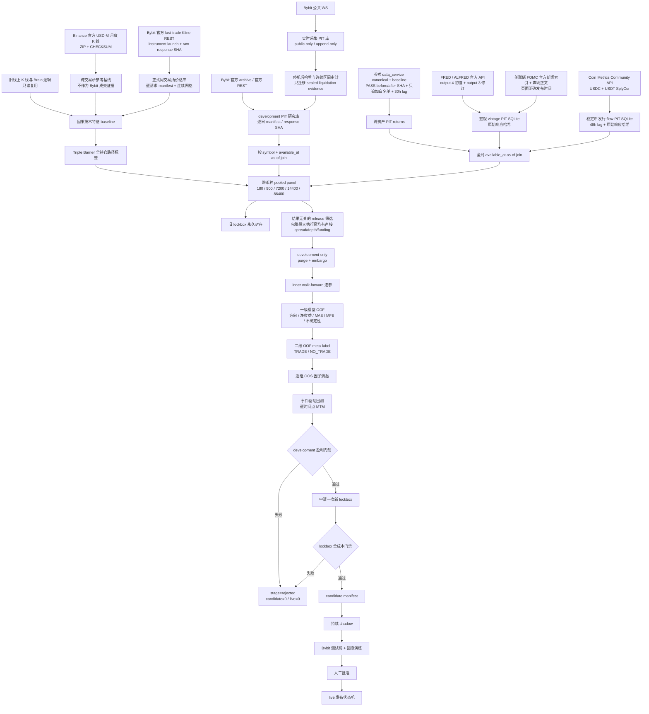
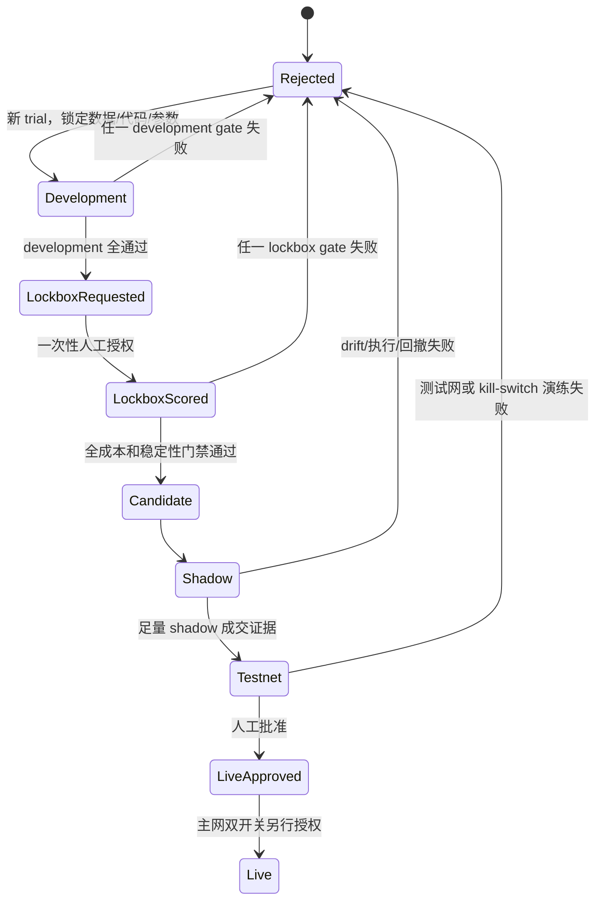

# Profitability-First Alpha v2：真实架构与边界

> 状态：可部署的 shadow 工程候选，持续运行能力仍需长时间 soak 验证；尚未达到 candidate/live 盈利门禁。当前 Brain 模型只保留为 baseline；Bybit 主网交易开关未启用。

## 1. 目标和成功定义

这套重构不以测试数量或分类准确率为成功标准。成功必须同时具备：

- 完全未参与调参的 lockbox 在手续费、点差、滑点、资金费后净收益为正；
- Profit Factor、bootstrap 收益下界、walk-forward 稳定性和真实盘中回撤全部过门禁；
- 收益不集中于单币种、单月份或单一行情；
- 通过持续 shadow、测试网、回撤演练和人工批准；
- 任一证据不足时失败关闭，不产生 `candidate_release_manifest.json` 或 OperationTicket。

任何历史结果都不能保证未来保本或必然盈利。

## 2. 总体架构图

## 3. 模块职责

| 层 | 主要模块 | 只负责什么 | 不允许做什么 |
|---|---|---|---|
| 原始数据 | `core/providers/*` | 抓取、解析、哈希、PIT 时间和 append-only 证据；Bybit K 线是正式价格路径，Binance 仅作参考基线 | 原地改写旧实验数据库、用 Binance 冒充 Bybit 价格/成交证据、训练、调参、生成交易信号 |
| PIT 接入 | `core/training/bybit_pit_panel.py`、`macro_pit_panel.py`、`flow_pit_panel.py`、`pit_factor_panel.py` | 冻结 sequence/SHA，按决策时间 as-of join，执行 staleness 和来源契约；Bybit 训练快照先按 development 决策窗裁剪 | 广播当前值到历史、整库载入无关未来观测、填造缺失因子 |
| 标签 | `core/labels/triple_barrier.py` | entry fill、TP/SL、max holding、费用、MAE/MFE、partial fill、exit reason | close-to-close 冒充成交结果 |
| 数据集 | `core/training/pooled_panel.py`、`core/evaluation/profitability_rebuild.py` | pooled panel、因果 regime、完整最大执行窗 direct-evidence release 子集、purge、embargo、sealed lockbox | 使用全样本定义 regime、按收益/退出原因选择 direct 样本、让 OHLCV 代理成本进入候选 folds、物化封存 lockbox 标签 |
| 选模 | `core/training/nested_walk_forward.py` | inner OOS 选参，outer OOS 只评分一次 | 用 outer OOS 调参 |
| 模型 | `core/models/two_stage.py` | 一级 OOF 预测、二级 meta-label、OOF conformal/分位数校准 | 用训练内残差训练二级或声称校准 |
| 回测 | `core/backtest/event_driven.py` | 手续费、点差、动态滑点、funding、partial fill、timeout、latency、路径、MTM | 省略成本、只算收盘收益 |
| 门禁 | `core/evaluation/profitability_gate.py` | development/lockbox 盈利、回撤、稳定性、集中度和压力测试 | 降低门槛迁就模型 |
| 发布 | `core/release/*` | 绑定模型、报告、commit、lockbox fingerprint，并逐份验证 walk-forward、lockbox、消融、成本、风控、统计、覆盖、校准和生产 replay 的内容语义 | 只凭文件存在或 SHA 就接受不完整报告；未过门禁生成 candidate/live |
| 生产推理 | `core/data_fetch.py`、`core/models/profitability_runtime.py`、`core/result_manager.py` | 独立抓取新鲜 Bybit last-trade Kline，按签名 feature contract 读取 trad、Bybit、macro、flow 的最新严格 PIT 值，验证 release manifest 后产生并消费 `alpha_prediction` | 训练/推理跨交易所、Bybit 失败时回退 Binance、缺特征时填造、Brain baseline 独立出票 |
| 交易安全 | 原 hardening 交易模块 | cancel/REPLACE、hedge、kill switch、双开关 | 被研究代码绕过 |

## 4. 固定周期契约

周期定义只有以下一套：

| 名称 | 秒 | K 线 |
|---|---:|---|
| scalping | 180 | 3m |
| mid_short | 900 | 15m |
| trend | 7200 | 2h |
| trend_swing | 14400 | 4h |
| swing | 86400 | 1d |

标签、训练、模型 artifact、runtime 和 `ResultManager` 都必须使用同一秒数；不允许用旧名称偷偷映射到别的周期。

## 5. 当前真实因子来源

### 5.1 旧线上经验的复用

- 价格、成交量和 Brain 技术逻辑仍作为 `legacy_brain_technical` baseline。
- 旧模型、数据库和策略均保留，当前状态为 rejected/baseline，不独立出票。
- 因果技术特征只使用决策点之前的 K 线；regime 在每个训练窗口内因果计算。
- 旧 K 线库和 Binance 官方月度归档继续保留，用于复现旧线上经验与跨交易所参考；它们不能授权 Bybit 正式标签、回测或候选发布。
- 正式实验先复制成新版本 `kline_feature_store.profitability-v3-bybit.sqlite3`，再从 Bybit 官方 `/v5/market/kline` 读取 last-trade OHLCV；每个请求保存完整 URL、请求/接收时间、原始响应 BLOB、长度、SHA-256 和子窗口边界。
- 每个 symbol 另存 `/v5/market/instruments-info` 原始回执并核对 `LinearPerpetual`、USDT、Trading 和 `launchTime`。请求子窗口必须无重复、无越界且连续覆盖预注册窗口；响应和 `raw_kline(source=bybit)` 必须逐行一致。
- Binance 基线仍通过 SQLite snapshot 复制到 `kline_feature_store.profitability-v2.sqlite3`，读取官方 USD-M 月度 ZIP 与 `.CHECKSUM`，但 `kline_source=binance` 会在 development 门禁失败并禁止打开 lockbox。
- 每个月同时校验官方 URL、ZIP/Checksum SHA-256、唯一 CSV member、毫秒时间戳、OHLC 不变量、周期长度、月内连续网格和月份归属；完成 manifest 不可修改。
- 3m/15m/2h/4h/1d 的固定最低连续历史分别为 180/365/1095/1095/1825 天。较新币种只有在首个官方月验真、紧邻前月的 archive 与 checksum 均为真实 404，且实验预检重新哈希保留文件后，才允许使用 `VERIFIED_SINCE_LISTING` 边界；否则仍按固定门槛失败。

### 5.2 Bybit 短周期

| 因子组 | 原始来源 | 证据语义 |
|---|---|---|
| orderbook | Bybit public orderbook WS、官方历史 archive | L5 delta、spread、depth、microprice；archive 是 exchange-event replay，不冒充 live capture |
| public trades | Bybit public trades WS、官方历史 archive | trade imbalance、OFI/CVD；保留 event/available/ingested 时间 |
| derivatives | Bybit 官方 funding、OI、mark/index kline REST | basis、settled funding、OI change；每个响应保留哈希和请求 manifest |
| liquidations | `allLiquidation` public WS | 按 Bybit 语义 `S=Buy => long position liquidated`；v1 永久失效，v2 生效 |
| execution quality | 真实盘口状态派生 | fill probability、expected slippage；没有盘口证据时不得用 OHLCV 猜测代替 |

liquidation 是 forward-only 证据：Bybit 当前公开 `allLiquidation.{symbol}` 只提供 500ms 实时 WS，V5 Market REST 没有公共历史爆仓接口。必须持续采满预先锁定的 180 天；不得用 OHLCV、成交量尖峰或第三方未审计聚合值回填。

覆盖跨度不等于连续性。orderbook/trades/derivatives 由每个 UTC 日的 completed 官方 archive/API manifest 证明，门禁取最短连续完成日数；liquidation 由停机后逐条验证 payload SHA 的 WS 审计证明，原始活动流按最多 90 秒间断切分，门禁取最长连续区间。运行中的 session、只存在首末爆仓事件、或首尾相隔 180 天但中间没有收据，均不能进入 OOS 消融。

capture audit 同时验证官方 public-linear endpoint、sealed session、订阅 symbol、topic/event-type 映射、event-to-receive 时延和 session 时间边界，并拒绝没有 session contract 的孤儿 raw row。连接活跃不能替代这些来源合同。

每条 `bybit.public.liquidations.v2` 特征还必须按确定性 observation ID 回指同 symbol、同 `received_at` 的原始 `allLiquidation` event，并重新校验 feature payload SHA；训练 loader 会重复执行该绑定检查。只写一个可信 source 名称、但没有 raw event 的“爆仓因子”不能进入训练、审计或跨库导入。

historical archive/API feature 还要与 data kind 一一绑定：orderbook、trades、funding、open_interest、basis 不能互相背书。API batch/response deterministic ID、官方 host/path 和 request manifest 在 loader 中重算；公开 REST 原始响应正文以 BLOB 留存，写入与读取时均重新核对 content length/SHA，只有哈希但没有正文的旧 API 证据失败关闭。

每个 completed archive/API batch 声明的 `feature_observation_count` 必须等于 trial 冻结 feature sequence 下数据库中实际引用该 archive/batch 的总行数。该检查覆盖不可变 trigger 安装前形成的旧库；manifest 仍在但特征缺行时整份 provenance 失败。

实时采集库与历史研究库物理分离。`core/providers/bybit_capture_audit.py` 先把停止后的 capture journal 封成不可变 audit，再以 append-only、冲突即失败的方式仅迁移 liquidation 原始事件、v2 特征、失效记录、session 和连续区间收据；archive/orderbook/trades/API 历史仍留在 development 仓。导入收据保存选择水位、源/新增计数和逻辑 manifest SHA，重复导入必须为零新增。

Bybit trial 除冻结 feature sequence 和 invalidation rowid，还冻结 capture-audit/import receipt rowid，并把四个水位共同写入 trial identity 与 snapshot SHA。raw/features/invalidations/API responses/audits/intervals/imports 在 SQLite trigger 层禁止更新删除；archive/API batch 从 `completed` 起不可修改。失败批次仍可原子重试为 completed，但完成证据不能被后来失败或相同 ID 的另一内容覆盖。

loader 会重新核对 capture audit 的 deterministic ID、manifest SHA 格式、连续 interval 索引/边界/最长时长、raw/topic/event-type/interval 计数守恒和 liquidation raw/feature 数量；import receipt 也要有 deterministic ID、合法 selection、非负计数并引用当前冻结 audit。只要研究库同时含历史 archive/API，liquidation audit 必须有对应 import receipt，手工复制 audit 行不能解锁消融。

### 5.3 中长周期跨资产

参考服务仅接纳 canonical panel 中显式白名单的基础价格。接入时同时核验最近一次 PASS 收据的 `canonical_sha_before`/`canonical_sha_after`、baseline/canonical 文件哈希，并逐行证明允许标的只追加新日期、没有改写或回填旧价格：

- SPY、QQQ；
- TLT、UUP；
- GLD、USO；
- XLV、IBB；
- FXI、KWEB；
- COIN、MSTR。

日频值使用 30 小时保守可用延迟。当前值、公式衍生列、无 PIT 的 MCP 列不得回填历史。SHA 绑定的全面板审计可以因为未使用的衍生列而失败，但 `symbol/ts/close` 范围内出现任何问题都会失败关闭；运行时还会重新读取该审计，不能靠进程缓存绕过后来新增的问题。价格水平不作为模型输入，只生成相邻市场收盘收益。

### 5.4 FRED / ALFRED vintage

| 因子 | 官方 series / output | 说明 |
|---|---|---|
| VIX | VIXCLS / output 4 | 初次发布值；节假日 carry 行使用更保守的 observation/vintage 最大日期 |
| 10Y 实际利率 | DFII10 / output 4 | 真实 TIPS real yield，不再用名义利率减 CPI 的代理冒充 |
| CPI 初值同比 | CPIAUCSL / output 4 | 只使用各月 first release |
| 非农初值变化 | PAYEMS / output 4 | 相邻月份 first-release level 差 |
| 失业率初值 | UNRATE / output 4 | first release |
| CPI/非农修订 | CPIAUCSL、PAYEMS / output 3 | 按 vintage 的实际修订 delta |
| Tier-A 状态 | CPI/非农 release vintage | 发布后 24 小时为 1，随后显式复位为 0 |
| FOMC 声明状态 | 美联储官方 FOMC 新闻索引和声明正文 | 只在页面明确标注的 release time 后变为 1，24 小时后复位；包含 2020 年紧急声明 |

FOMC 采集不能用会议日历日期猜测 14:00，也不能把 minutes、implementation note 或未来会议计划当成已发布声明。2018–2026-06-18 的实际研究仓证据为 70 份声明、79 份官方响应、140 个状态切换，时间顺序违规为 0。

所有宏观响应都保存原始内容 SHA-256；API key 不写入 URL descriptor、数据库、报告或异常。训练读取时先把 observation 时间统一解析为 UTC，再用 SQLite `julianday` 比较响应收据，禁止依赖混合 ISO 字符串的字典序；FRED/ALFRED 收据还必须限定在当前观察实际引用的官方 series，其他官方序列不能替它背书。

### 5.5 Flow

- 稳定币组使用 Coin Metrics Community API 的 USDC/USDT `SplyCur` 链上供应，派生 1 日/7 日净发行额和 7 日供应变化率。语义是发行/赎回，不是交易所净流入；available_at 使用 metric day + 48h，官方原始响应与 SHA-256 一并冻结，后续发现历史值冲突即失败关闭。
- DefiLlama 的当前重建 stock history 不作为这组历史 PIT 的证据，也不再使用误导性的 `stablecoin_exchange_netflow_1h` 名称。
- 数字资产 fund flow 使用 CoinShares 官方历史周报：sitemap、每篇原文、明确 `Published on` 日期和 SHA-256 全部保留，形成 `digital_asset_fund_flow_weekly_usd`。它是全球数字资产投资产品周净流量，不是每日 issuer-level ETF creation/redemption；年度汇总页和语义不明确页必须排除。
- parser 修正采用 append-only 新版本；旧错误解析不删除，而是写入失效记录。训练 loader 对同一发布时间只选择最高有效 sequence，并验证其原文哈希。
- 稳定币与 fund flow 分开消融，不能互相替代；只有真实 OOS 足量交易且费用后稳定增益的组才能进入正式 feature set。

## 6. 防泄漏与过拟合控制

1. `available_at <= decision_at`；标签只在完整退出路径结束后可用。
2. 同一决策时间的 BUY/SELL 是配对备选，不当成两个独立交易。
3. 持仓窗口不重叠采样；外层 purge 至少覆盖 horizon，另加 embargo。
4. 一级模型的 OOF 预测训练二级模型；分位数和 conformal 下界来自 OOF 校准。
5. inner walk-forward 可选参数；outer OOS 永不选参。
6. development 未通过前不打开新 lockbox；旧 lockbox 永久封存。
7. 所有实验进入 trial ledger，失败实验也保留。
8. 因子只有在完整组、足量真实 OOS trades、费用后稳定改善时才能 retained。
9. 盈利门禁不按单笔交易做独立同分布 bootstrap；先按 UTC 日聚合组合净 PnL、补齐无交易日，再对日簇做 moving-block bootstrap。少于 20 个日簇或任一交易缺少 UTC 时间戳时失败关闭。
10. Bybit 大库只读取 `[最早 development 决策 - 因子最大陈旧期, development 截止]` 且不超过 trial 冻结 sequence 的观测；新 lockbox 只有 development 通过后才建立独立时间窗快照。
11. 正式 walk-forward、因子消融和 lockbox 只能使用 `execution_window_evidence_complete=true` 的 release 子集。该标志必须在读取 Triple Barrier 收益、MAE/MFE 或 exit reason 之前，仅根据从下单等待到最大持仓结束的完整窗口是否逐 bar 同时具备独立的 bar-open 与 bar-close spread/depth，以及 settled funding 证据计算。价格路径覆盖只按连续 K 线 `close_time` 判断；funding 的较晚 `available_at` 只能推迟标签可用时间，不能伪造更长的价格路径。某周期 direct 样本不足时，该周期只能保存为 rejected shadow，不能用历史代理成本补足。
12. 因子消融按 horizon 独立判定。180 秒 fold 的正增益不能授权 900 秒使用，7200 秒结果也不能授权 14400/86400 秒使用。组级汇总均值仅供诊断；`horizon_results` 必须分别具备至少两个可交易 outer OOS folds 和完整直接成本证据。只有出现在该周期 `retained_horizons` 的因子才可装入该周期模型；任一适用周期缺证据时，组级 `formal_feature_set=false`，且总因子门禁失败。
13. max-holding 到点若落在 OHLC bar 内，不允许用到点前的旧 close 冒充到点成交价。标签只能使用最后一个真实完成 close 并记录它的实际 `exit_at`；若没有可用完成 bar，则保持 `NO_EXIT_OBSERVATION`，不能发明零收益或虚假退出时间。
14. K 线数据库的稳定 SHA-256、大小和修改时间共同进入 trial ID 与 source evidence；不能只靠路径或文件元数据区分实验。development 通过后在 lockbox 打开前重新哈希，lockbox 路径评分完成后再次重新哈希，任一阶段内容或元数据变化都终止 trial，不得用混合快照生成候选证据。
15. 封存 development 与 lockbox 边界之间固定 purge 一个完整 horizon，并同时要求 development 标签在边界前可用。不能只凭早止盈标签较早 available 就把靠近 lockbox 的重叠样本纳入训练；该筛选必须与结果无关。
16. development 预检只允许查询 K 线时间网格以预注册边界；OHLCV 在 SQL 读取层截断到 lockbox 之前。production replay 同样按其 development OOS 决策时间截断查询，禁止先加载/工程化 lockbox 价格再在 DataFrame 中过滤。完整 lockbox OHLCV 只有 development 全门禁通过并写入 claim 后才可读取。
17. development 内部再按时间把外层 OOS 拆成两段：较早一段只用于真实因子消融和冻结 feature set，较晚一段只用于冻结特征后的正式 development 评估。两段测试行不得重叠并保留 embargo；较晚 evaluation OOS 的收益、标签和门禁结果禁止反向改变 retained factors。默认至少六个 walk-forward folds，配置少于四个时直接拒绝启动。
18. 交易所 K 线若以 `interval_end - 1 ms` 表示最后一个有效毫秒，特征可用时间必须正规化到下一毫秒的真实 interval end；禁止在最后一个成交毫秒尚未结束时使用整根 K 线的 high/low/close。
19. 正式标签、训练、事件回测和生产推理必须使用 Bybit 同交易所 last-trade Kline。每根 `MarketBar`、每个标签和每笔回测交易都携带 `price_source/price_observed`；模型 bundle 绑定 `kline_source=bybit`。生产运行若收到 Binance frame、Bybit 断档或陈旧数据，Alpha 与 `ResultManager` 必须双重失败关闭。
20. 因子消融禁止 complete-case 选样。某 fold 的任一已安排 train/OOS 行缺少因子时，该 fold 必须记录 `FAILED_INCOMPLETE_FACTOR_COVERAGE`；不能删除缺失行后比较 baseline/augmented，也不能让研究阶段只看有值子集、最终训练做均值填补、生产阶段再因缺失拒绝。稳定币日序列从共同可用日起必须连续到请求结束日；周度 fund flow 的首部、内部、尾部缺口均不得超过其 15 天 staleness 合约。
21. production replay 或外部调用传入的 `latest_decision_at` 必须与价格 frame 最后一条真实观测时间完全一致。禁止用更晚的声明时间覆盖最后一根 K 线时间，否则会把陈旧价格伪装成新鲜数据，并使 Bybit/macro/flow 的 as-of join 读取到价格形成以后才可用的因子。
22. 正式 Alpha runtime 必须在模型边界重新验证至少 49 根价格的严格周期网格、有限且合法的 OHLCV；不能只信任上游抓取器或 `input_price_source` 字符串。candidate 包还必须再次按周期检查最后价格年龄，陈旧或未来时间一律 `NO_TRADE`。
23. `ResultManager` 不能只信任 Alpha 自报的 `candidate_freshness_verified=true`。出票边界必须再次要求下界净 edge、价格年龄和最大允许年龄都是有限数，实际 age 不超过按周期固定的上限，且 bar count/interval 可严格解析；`NaN`、无穷值、畸形结构或擅自放大的 freshness 上限都必须失败关闭而不是抛异常或出票。
24. 候选预测必须先完成 release/manifest/价格证据授权，再进入候选 release 的 active forecast book。未授权或畸形 Alpha 可保留为观测 forecast，但必须使用隔离的 rejected lineage，不能在后一条合法预测到来时参与多周期组合。获授权 forecast 的 exchange、data cutoff、feature age 与 OperationTicket reference price 必须来自同一份已复核的 Bybit Alpha price path，不能回退旧 Brain 的 Binance K 线或 Coinglass 展示价。
25. 获授权 Alpha 的 data quality、calibration status、market regime 与 range guard 必须来自新两级模型的运行时证据，不能继承旧 LSTM/Brain 的 completeness、scaler OOD 或市场状态。新模型输入必须在它自身保存的标准化空间计算 range guard；分数非有限或超过组合门限时，在写入候选 active book 前失败关闭。
26. 外部宏观面板的 production as-of 必须使用新 Alpha 的 Bybit 价格 frame 最后一条真实观测时间，不能使用旧 Binance frame 的截止时间。盈利报告、全部证据哈希和 candidate manifest 也不能只在进程启动时验证；每次候选出票前都必须重新核验，运行期间文件被替换或破坏时立即撤销内存中的授权并失败关闭。

## 7. 事件回测和回撤

回测以订单和市场事件为单位，而不是把预测行乘未来 close return：

- maker/taker fee、spread、动态 slippage、funding；
- fill probability、partial fill、order timeout；
- latency、cancel/fill race；
- 市场单 activation 若落在数据断档中，必须等待下一根可交易 bar 并按其 open 计入跳空；禁止沿用断档前的信号价格伪造成交；
- stop/take-profit 的盘中路径和 max holding；
- 单仓、总仓和杠杆约束；
- 每个市场观测点对所有持仓 mark-to-market，计算真实盘中组合 drawdown。
- 成交瞬间按 PIT reference/mid 而不是 fill price 标记权益，使入场 spread/slippage 立即进入回撤；2× 成本压力也同步作用于未平仓 funding MTM，不能只加压最终已实现收益。
- 组合 development/lockbox 至少 100 笔、每个启用 horizon 至少 30 笔；费用后净 `net_pnl` 胜率至少 52%，2× 手续费/滑点/funding 压力净收益必须大于等于 0。三个条件都是代码门禁，不能用运行参数下调。
- DSR 使用组合逐日 mark-to-market 收益、偏度、峰度、样本长度与预注册试验总数，放行概率不得低于 95%；PBO 使用固定 8 段 CSCV、同步的备选策略日收益矩阵，放行值不得高于 5%。备选策略只能在 development outer OOS 形成该矩阵；lockbox 只重算已冻结最终策略的 DSR，并继承 development PBO，禁止在 lockbox 上比较备选参数。
- 同日跨币种和重叠持仓在统计门禁中属于同一组合收益簇，不能重复增加有效样本数。

执行成本证据分两层，不能混写：

1. `official_pit_cost_inputs_complete` 要求 entry 使用在 bar open 前已可用的 Bybit 官方盘口 spread/depth，exit 使用另行按 bar close 对齐且在该时刻前已可用的官方盘口快照，并且持仓路径覆盖完整的官方 settled funding history。开仓快照不得复用于平仓成本；OHLCV 只负责保守 barrier path，不能证明盘口成本。
2. `shadow_or_testnet_fill_receipts_complete` 和 `queue_position_and_latency_calibration_complete` 要求独立、不可变的 OOS shadow/testnet 成交回执。历史归档中的 `fill_probability` 只是盘口深度探针，不是自有订单真实成交证明。

任一层缺失时 `execution_evidence_complete=false`。

没有真实盘口/成交的 shadow 证据时，`execution_evidence_complete=false`，即便回测盈利也不能晋升。

## 8. 发布状态机

当前分支不得进入 `LiveApproved` 或 `Live`。

## 9. 当前耦合性判断

已经拆开的边界：

- provider 不认识模型；
- PIT loader 不认识交易模块；
- model 不直接写订单；
- release manifest 是研究与生产推理之间的版本化接口；
- runtime 依据模型签名列决定是否必须读取 Bybit、macro 和 flow PIT 仓，缺仓、过期、未来时间或原始响应哈希不一致都会返回 `NO_TRADE`；
- `ResultManager` 只消费通过 manifest 校验的 `alpha_prediction`。

仍需继续降低的耦合：

- `core/evaluation/profitability_rebuild.py` 目前同时编排标签、因子消融、训练、回测和报告，是主要 orchestration hotspot；行为稳定后应拆成 dataset、ablation、development、lockbox 四个 runner。
- SQLite 同库同时承担 live capture 和大规模 archive replay 会放大 WAL/锁竞争；现已采用采集库与研究库分离，并通过已封存水位的最小化 append-only liquidation evidence import 交接。后续仍应把该交接放入独立作业队列，避免与 archive/API writer 并发。
- 外部参考 panel 的 2GB 级 SHA 全量校验成本较高；应保留 SHA 门禁，同时增加已验证 artifact receipt/cache，不降低校验标准。

## 10. 现阶段明确不成立的结论

- 测试通过不等于策略盈利；
- 数据接口存在不等于因子有效；
- 0 trades / 0 drawdown 不是合格结果；
- 回测历史正收益不能保证未来盈利；
- 当前仍没有可诚实宣称可放真钱的 release。
