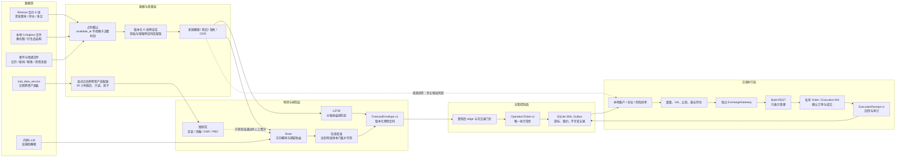

# 可读版产品架构 v2

更新时间：2026-08-23  
当前发布结论：**工程影子候选，不是主网候选**。

## 一张图看懂



## 读图规则

- 数据多不等于可交易。所有数据先经过点时、质量和来源门禁。
- LSTM、Brain、在线校准和 LLM 都没有下单权限；只有版本化操作票能进入交易端。
- 交易端拥有最后否决权。即使模型同意，账户回撤、保证金、价格偏离、时钟、私有流或 kill switch 不健康仍不下单。
- `trad_data_service` 当前只进入慢研究/影子观察，不进入方向融合。原因不是它没有价值，而是分类历史存在错标，且最新更新任务被阻断。
- Bybit REST 返回不是成交。成交只能由私有订单/成交流或按 `orderLinkId` 的恢复查询确认。

## 项目结构与耦合

| 边界 | 活跃入口 | 负责什么 | 禁止什么 |
|---|---|---|---|
| 预测控制面 | `ai_bot3/ai_bot3/api/control_plane_main.py` | 保存预测、出票、派发、接收回执 | 不读取账户、不计算最终张数、不调用私有下单 |
| 预测引擎 | `core/portfolio3_3_fixed.py` | 组装数据、模型、校准和结果 | 不直接接触交易所私钥 |
| 数据契约 | `contracts/`、`core/kline_feature_store.py` | 严格 schema、特征顺序、PIT 和版本 | 不允许缺列补 0 后冒充已训练输入 |
| 外部面板适配 | `core/providers/trad_panel_provider.py` | 只读四列、白名单、滞后、收据校验 | 不信任 5,332 列；不直接融合 |
| 交易服务 | `BybitContractBotV4/service_main.py` | 消费票据、风控、恢复、回执 | 不导入预测端内部模块 |
| 交易所边界 | `BybitContractBotV4/exchange_gateway.py` | 仅暴露票据执行所需 Bybit 操作 | 活跃服务不可调用旧版无票据平仓/改仓工具 |
| 旧经验规范 | `BybitContractBotV4/legacy_experience.py` | 无副作用地保存 v4.1 规则及来源 | 未验证规则不能自动激活实盘 |

目前耦合已经从“交易脚本直接解释预测 JSON、共享内部数据库”降为三份合同：`ForecastEnvelope`、`OperationTicket`、`ExecutionReceipt`。残余可读性债务是 `portfolio3_3_fixed.py` 和旧 UI `api_server.py` 仍较大；它们应继续按数据编排、模型服务、结果发布和兼容 API 拆分，但不应为追求目录漂亮而一次性重写。

## 快通道与慢通道

快通道只使用已在训练/推理两侧一致、足够新鲜的数据，目标是稳定地产生或拒绝预测。慢通道收集宏观、跨资产、链上、事件和新因子，先做点时复放、缺失审计、消融、费用后 OOS 和多重试验校正，再决定是否进入 candidate。两条通道分开，是为了让研究失败不会拖垮运行服务，也避免实验特征悄悄改变真钱信号。

## 发布状态

```text
rejected  -> 不可推理
shadow    -> 记录预测，不出票
candidate -> 仅允许显式测试网策略
live      -> 模型人工晋升 + 交易主网双开关 + approval id
```

当前真实状态：Brain 重训结果为 20 shadow、5 rejected、0 candidate、0 live；所以无论代码是否能连接交易所，都不满足真钱条件。

