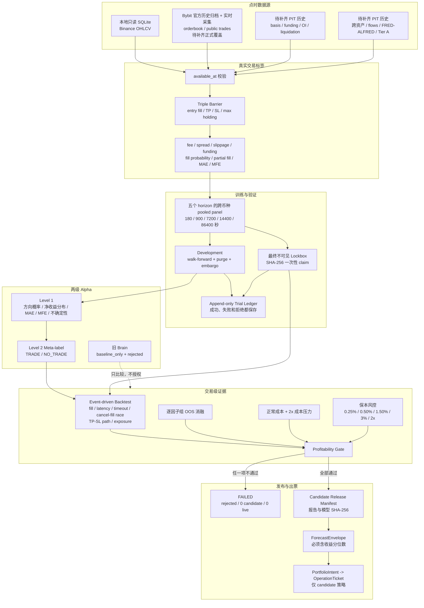

# Profitability-First Alpha Rebuild 架构与使用手册

更新时间：2026-08-24
当前发布状态：`profitability_gate=FAILED`、`candidate_count=0`、`live_count=0`。

这次重构保留了旧系统两年运行经验、模型文件、数据库和交易服务，没有启用 Bybit live，也没有改动主网双开关。改变的是“谁有权出票”：旧 Brain 方向分类器现在只做 baseline；只有两级 Alpha 在未参与调参的 lockbox 上通过全部费用、回撤、稳定性、压力和因子证据门禁，才允许生成 candidate manifest。candidate 也只对应显式测试策略，不能批准 live。

## 一张图看懂新链路



## 目录职责

| 目录/文件 | 责任 | 不允许做的事 |
|---|---|---|
| `core/labels/triple_barrier.py` | 从未来市场事件构建真实成交标签，保存 entry/exit、费用、滑点、资金费、MAE/MFE、成交概率和部分成交 | 使用决策时刻尚不可见的数据；用 close-to-close 冒充成交 |
| `core/training/pooled_panel.py` | 为五个固定 horizon 构建跨币种 panel；冻结 lockbox；生成 purge/embargo walk-forward | 单币种各自过拟合；把 lockbox 行放回训练 |
| `core/models/two_stage.py` | 一级预测分布和尾部风险，二级决定 TRADE/NO_TRADE | 自己把模型晋升为 candidate/live |
| `core/backtest/event_driven.py` | 模拟 maker/taker、spread、动态滑点、funding、部分成交、延迟、超时、竞态、止盈止损路径和组合敞口 | 只看收盘价差；忽略未成交和交易成本 |
| `core/evaluation/profitability_gate.py` | 同时检查 lockbox、PF、回撤、bootstrap 下界、2x 成本、fold 稳定性和收益集中度 | 单项好看就放行 |
| `core/evaluation/statistical_governance.py` | 追加式保存每次试验；lockbox 指纹只能由一个最终试验消费 | 删除失败试验；重复使用同一 OOS 调参 |
| `core/risk/capital_preservation.py` | 固化单笔/日/周/总回撤/杠杆和禁止摊平、马丁、无止损交易 | 通过配置提高到硬上限以上 |
| `core/release/profitability_release.py` | 只有 Gate 全通过时绑定报告、模型、lockbox、commit 的 SHA-256 manifest | Gate 失败时生成 candidate；批准 live |
| `core/result_manager.py` | 验证盈利报告、manifest、策略发布包和 Alpha 预测后才进入组合出票 | 使用 Brain 或普通 legacy 预测授权出票 |

旧的 `portfolio3_3_fixed.py`、Brain 模型、v4.1 交易逻辑、数据库和策略文件继续保留。旧经验中的止损、最长持仓、失败关闭、组合净额化、确定性订单和交易端最终否决权仍然复用；方向命中率直接晋升和只有均值收益即可出票的路径被关闭。

## 因子及来源

“已注册”不等于“已进入正式特征集”。每个组必须在相同 walk-forward fold、相同成本和相同回测器下做 OOS 消融；没有稳定费用后增益就保持 `retained=false`。

| 因子组 | 计划来源 | PIT/用途 | 当前状态 |
|---|---|---|---|
| Bybit orderbook delta、spread、depth、microprice | Bybit 官方 orderbook 历史归档和 V5 public orderbook 增量快照 | 交易时可见；短周期方向和执行成本 | 官方归档回放与实时采集已实现并用真实文件验算；正式多币种覆盖和消融未完成 |
| public trades、OFI、CVD | Bybit 官方 public trades 历史归档和实时流 | 交易时可见；主动买卖流 | 官方归档回放与实时采集已实现并用真实文件验算；正式多币种覆盖和消融未完成 |
| basis、funding、OI、liquidations | Bybit 官方 funding/OI/mark/index 历史接口；实时 liquidation 流；本地 Coinglass wrapper 只作补充 | 使用交易所事件时间和保守 available_at | funding/OI/basis 历史回放已实现并真实验算；liquidation 无官方历史 REST，正式组仍不完整且未进入正式集 |
| fill probability、slippage | Bybit 私有 ExecutionReceipt + 同时刻盘口；shadow/testnet 成交样本 | 只使用当时可得盘口与后续成交标签 | 历史盘口可计算 top-5 深度扫单完成比例和 VWAP 滑点，但它不是排队成交概率；真实 fill/partial fill 仍缺 shadow/testnet 回执证据 |
| SPY、QQQ、VIX | 参考数据服务基础价格 + FRED VIX vintage | 美股交易时段和发布延迟对齐 | SPY/QQQ 已通过 baseline→canonical 追加式修订审计，VIX 走独立 PIT 仓；只可进入真实 OOS 消融，尚未因稳定增益进入正式集 |
| TLT、real yield、UUP | 参考数据服务基础价格 + FRED/ALFRED vintage | 利率和美元环境；宏观值按 vintage | TLT/UUP 使用同一追加式价格契约，real yield 走独立 PIT 仓；正式保留仍取决于完整逐组 OOS 消融 |
| GLD、USO、XLV、IBB、FXI、KWEB、COIN、MSTR | 参考数据服务显式白名单基础价格 | 跨资产收益按市场收盘/可用时间对齐 | 12 个训练标的合计核验 12,574 个历史重叠价格、24 个仅向后新增价格、0 改写、0 旧日期回填；全面板衍生列不受信任，正式保留仍取决于费用后 OOS 消融 |
| ETF/stablecoin flows | 可审计 ETF 流量和链上/交易所净流数据 | 以官方发布日期或区块确认后的 available_at 为准 | 缺完整 PIT 历史，未进入正式集 |
| FRED/ALFRED vintage | FRED/ALFRED | 禁止用最终修订值回填历史 | 未接入完整 vintage |
| Tier A 重大事件 | 分级事件库；官方日历/公告优先 | 记录 published_at、available_at、事件级别 | 当前历史不足，未进入正式集 |

当前正式基线只使用本地 SQLite 中的五币种 Binance OHLCV 技术特征。Bybit 官方归档数据尚未达到预登记的多币种时间覆盖、逐组 OOS 消融和成交回执要求，因此也尚未进入正式 feature set。OHLCV 推导的 spread/depth 只能用于保守地验证软件链路；官方盘口回放可以证明历史盘口状态和扫单成本，但二者都不能替代真实 shadow/testnet fill 回执。报告必须继续写 `execution_evidence_complete=false`，不能授权 candidate。

## Bybit 官方历史归档回放

`core/providers/bybit_historical_archive.py` 只接受显式白名单中的 Bybit HTTPS 主机。它逐文件下载并校验 Content-Length、SHA-256、ZIP 成员、CRC、symbol、交易日、事件时间和订单簿序列，再从 snapshot/delta 重建 L2 状态。每个文件的全部派生特征和完成状态在同一个 SQLite 事务内提交；任何解析或时间校验失败都不会留下半个成功文件。原始 `event_time`、保守的 `available_at`、实际 `ingested_at`、归档 URL 和哈希都会保存，历史回放不会伪装成实时采集。

安全机器上的回填入口如下。程序按日、按币种、按数据类型串行处理，默认成功后删除本地压缩包，避免同时占用整个区间的磁盘；已经完成且哈希登记成功的文件会跳过，失败文件会保留失败证据并可重试：

```powershell
Set-Location D:\Money
python ai_bot3\ai_bot3\scripts\backfill_bybit_historical_archive.py `
  --start 2026-07-15 `
  --end 2026-08-20 `
  --database ai_bot3\ai_bot3\data\bybit_public_pit.sqlite3 `
  --report ai_bot3\ai_bot3\model_results\evaluation\bybit_archive_backfill_report.json
```

默认覆盖 BTCUSDT、ETHUSDT、XRPUSDT、SOLUSDT、1000PEPEUSDT 的 orderbook 和 public trades。归档回放只提供当时盘口/逐笔的可审计市场事实：其中 `fill_probability` 兼容字段当前表示给定名义金额在 top-5 深度内的双边扫单完成比例，不代表 maker 排队成交概率，也不构成 execution evidence。OI、funding、basis 和 liquidation 必须由各自 PIT 数据源补齐；前三者已有下述官方 REST 回放，liquidation 仍缺足量历史。尤其不能用 OHLCV 或普通成交量反推爆仓后宣称数据完整。

2026-08-24 的隔离库实测使用 Bybit 官方 2026-08-01 1000PEPEUSDT 文件：读取 528,558 条订单簿事件和 118,194 条逐笔成交，写入 45,656 条订单簿特征、7,670 条逐笔特征；PIT 时间违规为 0，两个归档文件的 SHA-256 和完成清单均可追溯。这证明适配器真实读取了官方数据，不代表 37 天五币种正式覆盖、消融或盈利门禁已经完成。

同一天的官方衍生品历史 REST 回填入口如下：

```powershell
python ai_bot3\ai_bot3\scripts\backfill_bybit_historical_derivatives.py `
  --start 2026-07-15 `
  --end 2026-08-20 `
  --database ai_bot3\ai_bot3\data\bybit_public_pit.sqlite3 `
  --report ai_bot3\ai_bot3\model_results\evaluation\bybit_derivatives_backfill_report.json
```

它逐日读取实际结算 funding、5 分钟 OI 以及 1 分钟 mark/index kline，并从严格向后的 1 小时 OI 和同时刻 mark/index 计算 `open_interest_change_1h` 与 `perpetual_basis_bps`。每个请求的 URL、响应 SHA-256、行数和时间都会绑定到原子提交的日批次。2026-08-01 的 1000PEPEUSDT 真实隔离烟测得到 funding 3 条、OI 变化 288 条、basis 1,440 条，共 1,731 条，7 个官方 REST 响应，PIT 时间违规为 0。该接口没有历史 liquidation，因此 liquidation 只允许从已经按事件时间持续采集的官方实时流或有审计合同的历史源补齐。

### Liquidation side v2 修正

查错时确认旧 collector 对 Bybit `allLiquidation` 的 `S` 字段解释反了。官方契约是 `Buy=多仓被强平`、`Sell=空仓被强平`；旧实现误写成相反方向，使 `liquidation_imbalance_5m` 符号倒置。修复后新来源固定为 `bybit.public.liquidations.v2`，正值表示 5 分钟窗口内空仓强平名义金额更多，负值表示多仓强平更多。

旧观测不会删除：数据库追加 `bybit_feature_invalidations` 记录，使 v1 行在训练和运行时读取中失效，同时保留审计原文。因为 collector 已逐条保留原始 liquidation 事件，可以运行下列命令重建 v2；它只追加更正观测，并输出失效/重建计数：

```powershell
python ai_bot3\ai_bot3\scripts\rebuild_bybit_liquidation_semantics.py `
  --database ai_bot3\ai_bot3\data\bybit_public_pit.sqlite3 `
  --report ai_bot3\ai_bot3\model_results\evaluation\bybit_liquidation_semantics_rebuild_report.json
```

## 盈利门禁

以下条件必须同时成立：

- lockbox 费用后净收益大于 0；
- profit factor 不低于 1.20；
- 最大回撤不高于 3%；
- 95% block-bootstrap 单笔期望下界大于 0；
- 2x 成本压力下不出现明显亏损；
- 至少 60% walk-forward folds 费用后正收益；
- 正收益不超过 50% 集中于单币种、单月份或单 regime；
- 至少 30 笔真实回测交易；
- 完整执行证据和所有必需因子组消融均完成。

任何一项不满足时，输出固定为：

```text
profitability_gate=FAILED
candidate_count=0
live_count=0
```

失败运行不会生成 `candidate_release_manifest.json`。如果输出目录里残留旧 manifest，程序会保留到 `archive/`，同时从当前授权位置移走，避免旧候选误授权。

## 如何运行

在安全机器内进入 `ai_bot3/ai_bot3`，先确认本地历史库存在。命令只读市场库，新模型、试验账本和报告写入独立目录：

```powershell
python scripts/run_profitability_rebuild.py `
  --feature-store data/kline_feature_store.rebuilt.20260822.sqlite3 `
  --output-dir model_results/evaluation `
  --trial-ledger data/research_trials.sqlite3 `
  --model-output-dir models/profitability `
  --max-bars-per-symbol 3000 `
  --walk-forward-folds 3
```

程序会直接读取本地版本历史的 `HEAD`；如果显式传入 `--code-commit`，它必须与实际 `HEAD` 完全一致，否则在读取 lockbox 前终止。

退出码：`0` 表示盈利门禁通过并生成 candidate manifest；`2` 表示评估完整但门禁失败；`1` 表示流水线异常。后两种都必须视为无候选。

必读报告：

1. `profitability_report.json`：最终结论和逐门禁实际值；
2. `walk_forward_report.json`：各 horizon/fold 的训练测试范围和费用后结果；
3. `lockbox_report.json`：一次性 lockbox 指纹、来源范围和逐交易记录；
4. `factor_ablation_report.json`：每组是否完成、是否保留；
5. `execution_cost_report.json`：正常和 2x 成本结果及证据限制；
6. `capital_preservation_report.json`：不可放宽的保本参数；
7. `candidate_release_manifest.json`：只在全部通过时存在。

## 验证与后续工作

历史正式真实库评估使用 5 个 horizon、15 个 walk-forward fold；development/lockbox 行数分别为 25,058/4,422、25,060/4,420、25,060/4,420、25,060/4,420、17,330/3,740。旧运行在保守的费用后下界门禁下没有产生信号或交易，因此净收益、回撤和成本压力显示为 0；这不是“低回撤盈利”，而是“没有可交易 Alpha”。现在零交易消融会明确标记 `FAILED_INSUFFICIENT_OOS_TRADES`，不得再算作已评估或进入正式特征集。

截至 2026-08-24，预测侧回归 184 项通过，交易侧 hardening、HTTP→shadow→receipt 和依赖漏洞审计继续通过；真实 Bybit 官方 orderbook/trades 归档与 funding/OI/basis REST 一日回放也已通过隔离库验算，liquidation side v1 失效与 v2 重建测试通过。但 37 天五币种覆盖、足量 liquidation、真实成交回执、全部因子 OOS 消融以及未消费的新 development 证据仍未完成，所以当前状态仍是 FAILED / SHADOW_ONLY，而不是可部署 candidate。

本次 lockbox 指纹是 `893488f8cee82c568316cd54c6ec0017bf39d685ea17dc1aab95ed4a9a299741`，已在 trial ledger 中一次性登记，不会再次用于调参或评估。运行后核对发现命令行声明的完整 commit 字符串存在人工抄写错误；实际运行代码是提交 `7579fb63f93f0e77cf311ec73777de0291b361f8`。本次没有重跑 lockbox，而是以 append-only correction 记录声明值和实际值，计算结果不变；运行器也已增加 HEAD 强校验，防止再次发生。

下一阶段不是继续在同一 lockbox 调参，而是先补建独立 PIT 数据：Bybit orderbook/public trades、衍生品历史、跨资产行情、FRED/ALFRED vintage、flows、Tier A 事件和 shadow/testnet ExecutionReceipt。数据版本冻结后，从新的 development 区间做逐组消融，并预先登记一个全新的最终 lockbox；旧 lockbox 不得再用于选择参数。
